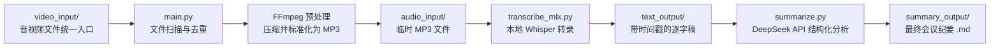

# Decision Keeper

> **"Unleash your brain from 8-hour meeting marathons."**
> **"告别时长焦虑,把精力留给决策。一个专为超长会议设计的本地化 AI 助理。"**


---

## 🌟 项目简介

**又一个会议记录工具?不,这是为解决 6-8 小时超长会议噩梦而生的 MVP。**

作为一名每天面对 6-8 小时会议的产品经理,我深受市面上工具"限时、收费、无法处理超长视频"的困扰:

- ❌ 商业软件普遍有 120 分钟时长限制
- ❌ 云端转录服务按小时计费,长会议成本爆炸
- ❌ 本地开源方案稳定性差,5 小时视频跑到一半就崩溃

**Decision Keeper 的诞生理由很简单:**

- **♾️ 无视时长**:实测轻松处理 **5小时+** 的连续视频会议,不再有"超过2小时就不转录"的焦虑
- **💸 本地算力零成本**:利用 Mac NPU (Apple MLX) 进行 Whisper 转录,大文件完全在本地完成,只有最后的文本总结才调用 API
- **🎯 决策导向**:拒绝流水账。利用 DeepSeek 总结能力,将 5 小时的废话提炼为 5 分钟的"决策点"与"待办清单"
- **🔒 数据隐私**:视频/音频文件不出本地,只有脱敏后的文本才会被发送给 LLM

**架构灵活,随时可换本地大模型替代 DeepSeek API。**

---

## ✨ 核心特性

- **♾️ 无限时长 (Unlimited Duration)**
  打破商业软件的 120 分钟限制,无论是半天的研讨会还是全天的培训,丢进去就能跑,稳定不崩溃。

- **💸 极致低成本 (Cost Efficient)**
  利用 Mac 本地算力 (NPU) 进行 Whisper 转录,无需为昂贵的语音 API 付费。只有最后的文本总结才调用 DeepSeek API (且架构支持换成本地大模型实现完全离线)。

- **🎯 决策导向 (Decision Driven)**
  拒绝流水账。利用 DeepSeek 总结能力,将 5 小时的废话提炼为 5 分钟的"决策点"与"待办清单"。

- **🔒 数据隐私 (Privacy First)**
  视频/音频文件完全在本地处理,只有脱敏后的文本才会被发送给 LLM 进行总结。

- **🛠️ 工程化细节**
  - 多格式支持:`.mp3`, `.wav`, `.m4a`, `.aac`, `.flac`, `.mp4`, `.mov`, `.mkv`, `.webm`
  - 增量处理:自动跳过已处理的文件,避免重复计算
  - 智能清洗:自动去除文件名特殊字符,生成规范的文档命名

---

## 🏗️ 工作原理



---

## 🚀 快速开始

### 环境要求

- **操作系统**：macOS（推荐 M1/M2/M3 系列芯片以获得最佳 Whisper 性能）
- **Python**：3.10 或更高版本
- **FFmpeg**：用于音视频预处理（[安装指南](https://ffmpeg.org/download.html)）

### 安装步骤

1. **克隆仓库**

```bash
git clone https://github.com/your-username/decision-keeper.git
cd decision-keeper
```

2. **创建虚拟环境并安装依赖**

```bash
# 创建虚拟环境
python3 -m venv .venv

# 激活虚拟环境
source .venv/bin/activate

# 安装核心依赖
pip install mlx-whisper openai python-dotenv
```

3. **配置 DeepSeek API Key**

创建 `.env` 文件（可参考 `.env.example`）：

```bash
DEEPSEEK_API_KEY=sk-your_api_key_here
SUMMARY_FOLDER=./summary_output
```

> 💡 如何获取 DeepSeek API Key：访问 [DeepSeek 开放平台](https://platform.deepseek.com/) 注册并创建 API Key

### 运行方法

1. **准备会议录音**

将音视频文件统一放入 `./meeting_input/` 文件夹：
- 支持格式：`.mp4`, `.mov`, `.mkv`, `.webm`, `.mp3`, `.wav`, `.m4a`, `.aac`, `.flac`
- 系统会自动使用 FFmpeg 将所有文件压缩并标准化为 MP3 格式

2. **执行主程序**

```bash
# 确保在虚拟环境中
source .venv/bin/activate

# 运行
python main.py
```

3. **查看结果**

生成的 Markdown 纪要位于：

- 默认：`./summary_output/`
- 自定义：`.env` 中 `SUMMARY_FOLDER` 指定的路径

---

## 📂 项目结构

```
decision-keeper/
├── main.py              # 主程序：文件扫描、去重、任务调度
├── transcribe_mlx.py    # 本地 Whisper 转录模块
├── summarize.py         # DeepSeek API 结构化总结模块
├── meeting_input/       # 会议输入目录（入口）
├── video_input/         # 音视频文件清洗（自动清理）
├── audio_input/         # FFmpeg 处理后的标准化 MP3（自动清理）
├── text_output/         # 临时转录文本（自动清理）
├── summary_output/      # 最终 Markdown 纪要输出目录
├── models/              # Whisper 本地模型存放目录
├── .env                 # 环境变量配置文件（需自行创建）
└── requirements.txt     # Python 依赖列表
```

### 核心文件说明

| 文件                | 作用                                                                                               |
| ------------------- | -------------------------------------------------------------------------------------------------- |
| `main.py`           | 调度中心：扫描 video_input，使用 FFmpeg 标准化音频，调用转录与总结模块，处理完成后自动清理临时文件 |
| `transcribe_mlx.py` | 调用本地 Whisper 模型（4-bit 量化），输出带时间戳的中文逐字稿                                      |
| `summarize.py`      | 通过 DeepSeek API 提取"一句话摘要"、"核心决议"、"待办清单"等结构化信息                             |

---

## ⚙️ 配置说明

### `.env` 文件详解

```bash
# 必填：DeepSeek API 密钥
DEEPSEEK_API_KEY=sk-xxxxxxxxxxxx

# 可选：自定义输出路径（默认为 ./summary_output）
SUMMARY_FOLDER=/path/to/your/obsidian/vault

# 可选：自定义 Whisper 模型路径（需修改 transcribe_mlx.py 中的 MODEL_PATH 变量）
```

### Whisper 模型配置

默认使用 4-bit 量化模型（位于 `./models/turbo-4bit`），如需更换模型：

编辑 `transcribe_mlx.py` 第 8 行：

```python
MODEL_PATH = "./models/your-model-name"
```

> 💡 推荐模型：`large-v3-turbo`（平衡速度与精度），详见 [mlx-whisper 文档](https://github.com/ml-explore/mlx-whisper)

---

## 📋 输出格式示例

生成的 Markdown 纪要包含以下结构：

```markdown
# 会议纪要：{自动生成的标题}

## 📌 一句话摘要

{50 字以内的核心目的摘要}

## 👥 关键议题与讨论

- 议题一：核心观点/冲突点
- 议题二：...

## ✅ 决议与待办 (TODO)

**🚀 核心决议：**

- [P0] {重要决议内容}
- [P1] {次要决议内容}

**📝 待办清单：**

- [ ] @张三：完成调研报告 [本周五]
- [ ] @李四：准备演示文稿 [下周三]

## 💡 详细内容记录

{按时间或逻辑顺序的详细会议内容}
```

---

## 🔒 隐私与安全

- **本地转录**：Whisper 运行在你的 Mac 上，录音数据不会离设备
- **API 最小化**：仅将文本摘要发送至 DeepSeek API（不包含原始音频）
- **自动清理**：中间文件（`.txt` 逐字稿）处理完成后自动删除

---

## 🤝 贡献指南

欢迎提交 Issue 和 Pull Request！

1. Fork 本仓库
2. 创建特性分支 (`git checkout -b feature/AmazingFeature`)
3. 提交更改 (`git commit -m 'Add some AmazingFeature'`)
4. 推送到分支 (`git push origin feature/AmazingFeature`)
5. 开启 Pull Request

---

## 📄 开源协议

本项目采用 [MIT License](LICENSE) 开源协议。

---

## 🙏 致谢

- [mlx-whisper](https://github.com/ml-explore/mlx-whisper) — Apple Silicon 上的本地 Whisper 实现
- [DeepSeek](https://www.deepseek.com/) — 强大的开源大语言模型
- [OpenAI Python SDK](https://github.com/openai/openai-python) — API 客户端库

---

<div align="center">

**让决策不被遗忘，让会议更有效率** ⚡️

Made with ❤️ by Decision Keeper Team

</div>
